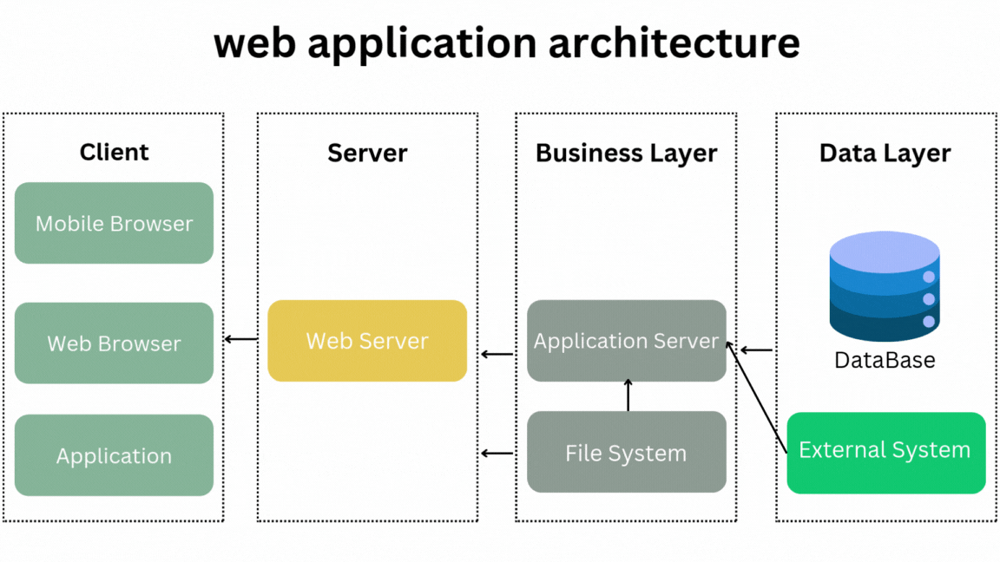

<h1>Average Solution</h1>

It's a website for digital solutions

	

    <b>
      Work Team:
    </b>
  

	 
  <ul>
    <li>Alsaaeid Ellithy Johar</li>
  </ul>

I am celebrating the completion of the Portfolio Project with Alex Scholarship.

 

<h1>“Technology Stack”</h1>

	

    <b>
      Front-end Development:
    </b>
  

	 
  <ul>
    <li>HTML/CSS: These are the fundamental building blocks for creating the user interface and styling the platform.</li>
    <li>JavaScript: Used for implementing interactive features, user interactions, and dynamic content on the platform.</li>
    <li>React.js: Popular JavaScript framework for building robust and scalable front-end applications.</li>
  </ul>

 

	

    <b>
      Back-end Development:
    </b>
  

	 
  <ul>
    <li>Programming Languages: Common language used for back-end development include Node.js.</li>
    <li>Framework: Framework such as Express.js (Node.js) can be used to streamline development and provide additional functionality.</li>
    <li>Database: A database management system like MongoDB may be used to store and manage data related to users, courses, assignments, and other platform information.</li>
  </ul>

 

	

    <b>
      API Development:
    </b>
  

	 
  <ul>
    <li>RESTful APIs: API can be developed using framework like Express.js (Node.js) to facilitate communication between the front-end and back-end components of the platform.</li>
  </ul>

 

	

    <b>
      Cloud Infrastructure:
    </b>
  

	 
  <ul>
    <li>Cloud Hosting: Platforms may be hosted on cloud infrastructure providers like Amazon Web Services (AWS), Microsoft Azure, or Google Cloud Platform for scalability, reliability, and ease of deployment.</li>
    <li>Server Deployment: Technologies like Docker and Kubernetes can be used for containerization and efficient deployment of the platform.</li>
  </ul>

 

	

    <b>
      Security:
    </b>
  

	 
  <ul>
    <li>Authentication and Authorization: Technologies like OAuth, JWT (JSON Web Tokens), or OpenID Connect can be used to implement secure user authentication and authorization.</li>
    <li>Encryption: SSL/TLS certificates and encryption protocols like HTTPS can be used to secure data transmission.</li>
  </ul>

 

<h1>“PLD: Average-Solution”</h1>

PLD: Portfolio Project Check-in for “Average-Solution” for platform Management for digital solution.

 
<h2>Objective:</h2>

The Portfolio Project Check-in feature aims to provide a platform To provide digital services like digital design and web development and photography projects.

 

	

    <b>
      User Stories:
    </b>
  

	 
  <ul>
    <li>As a service provider, I want to be able to upload images of my completed projects along with descriptions, so that potential clients can assess the quality and style of my work.</li>
    <li>As a platform administrator, I want to be able to review and moderate portfolio uploads to ensure that they align with platform guidelines and standards, maintaining the quality of showcased work.</li>
    <li>As a customer, I want to be able to add or check out the service to my cart, complete the process, and submit.</li>
  </ul>

 

	

    <b>
      Features:
    </b>
  

	 
  <ul>
    <li>Portfolio Upload: Service providers can upload images of their completed projects, including titles, descriptions, and relevant details for each portfolio item.</li>
    <li>Portfolio Browsing: Potential clients can browse through service providers' portfolios, view images, read descriptions, and assess the quality of their work.</li>
    <li>Moderation Panel: Platform administrators have access to a moderation panel to review and approve portfolio uploads, ensuring that only high-quality work is showcased on the platform.</li>
  </ul>

 

	

    <b>
      Components:
    </b>
  

	 
  <ul>
    <li>User authentication and profiles.</li>
    <li>The platform should have a system to send notifications To confirm the email.</li>
    <li>Project creation and management tools.</li>
    <li>Portfolio showcase for designers and photographers.</li>
    <li>Messaging and communication features for clients and service providers.</li>
    <li>AddToCart processing.</li>
    <li>File sharing and collaboration tools.</li>
    <li>Service listings and search functionality.</li>
    <li>Basic analytics and reporting features.</li>
    <li>Responsive design for mobile and desktop access.</li>
    <li>Feedback and review system for clients and service providers.</li>
  </ul>

